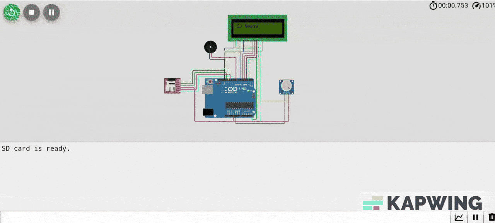
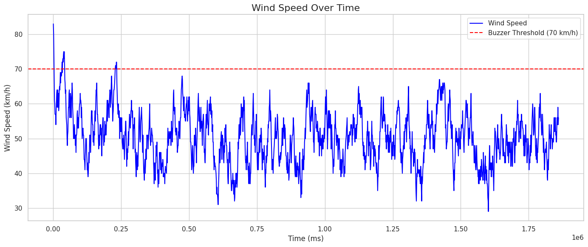
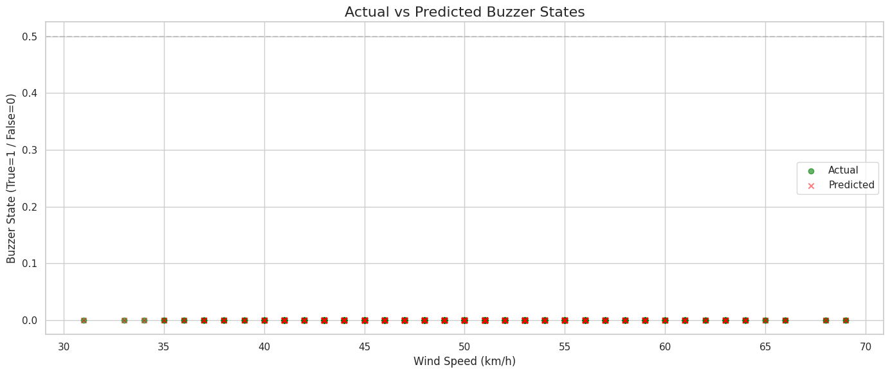

# 🌬️ Smart Wind Alert System

A simulated wind speed monitoring and alert system powered by Arduino (via Wokwi) and Machine Learning capable of analyzing environmental data, triggering alerts, and learning patterns using Python.

---

## Project Overview

This project emulates a wind speed detection system using **Wokwi’s virtual Arduino platform**. It integrates a **potentiometer** (as wind input), **LCD display**, **buzzer alert**, and **SD card logging**. After running the simulation, data is analyzed using **Python in Google Colab** to build a machine learning model that predicts buzzer activity based on wind speed.

---

## Technologies & Tools Used

- **Hardware Simulation:** Wokwi (Arduino Uno, LCD, Potentiometer, Buzzer, SD Card)
- **Embedded Code:** Arduino C
- **Data Processing:** Python, Pandas, Matplotlib, Seaborn
- **Machine Learning:** RandomForestClassifier (scikit-learn)
- **Dataset:** Wind speed over 30 minutes (CSV export)

---

## Sample Dataset

| Time (ms) | WindSpeed (km/h) | Buzzer |
|-----------|------------------|--------|
| 11482     | 59               | 0      |
| 12482     | 74               | 1      |
| 13482     | 76               | 1      |

> The buzzer is triggered if wind speed ≥ 70 km/h.

---

## Wind Speed Visualization

Visualizing wind speed over time with alert threshold line:

---

## Machine Learning Model

The collected data is used to train a **Random Forest classifier** to predict whether the buzzer will be active, given the current wind speed.

- **Feature:** Wind Speed (km/h)
- **Label:** Buzzer (0 = off, 1 = on)
- **Test Accuracy:** ✅ High prediction accuracy on unseen data

---

## 📚 Project Files

- `SmartWindAlertSystem.ipynb`: Final Python notebook (Google Colab)
- `wind_dataset.csv`: Collected data from simulation
- `README.md`: Project documentation
- `images/`: Screenshots and visualization assets

---

## 📄 License

This project is licensed under the MIT License.  
See the [LICENSE](LICENSE) file for full details.

---

## 🌐 Live Resources

- 🔗 [Colab Notebook](https://colab.research.google.com/drive/19u057AKkOe8D0UCo3o3r8gAZI9Qb0SMA?usp=sharing)  
- 🔗 [Wokwi Simulation](https://wokwi.com/projects/434561782296506369) 

---

## 👋 Author

**Merve Sena Çınar**  
Computer Engineering

Let’s connect: [LinkedIn Profile](https://www.linkedin.com/in/mervesenacinar/)

---
